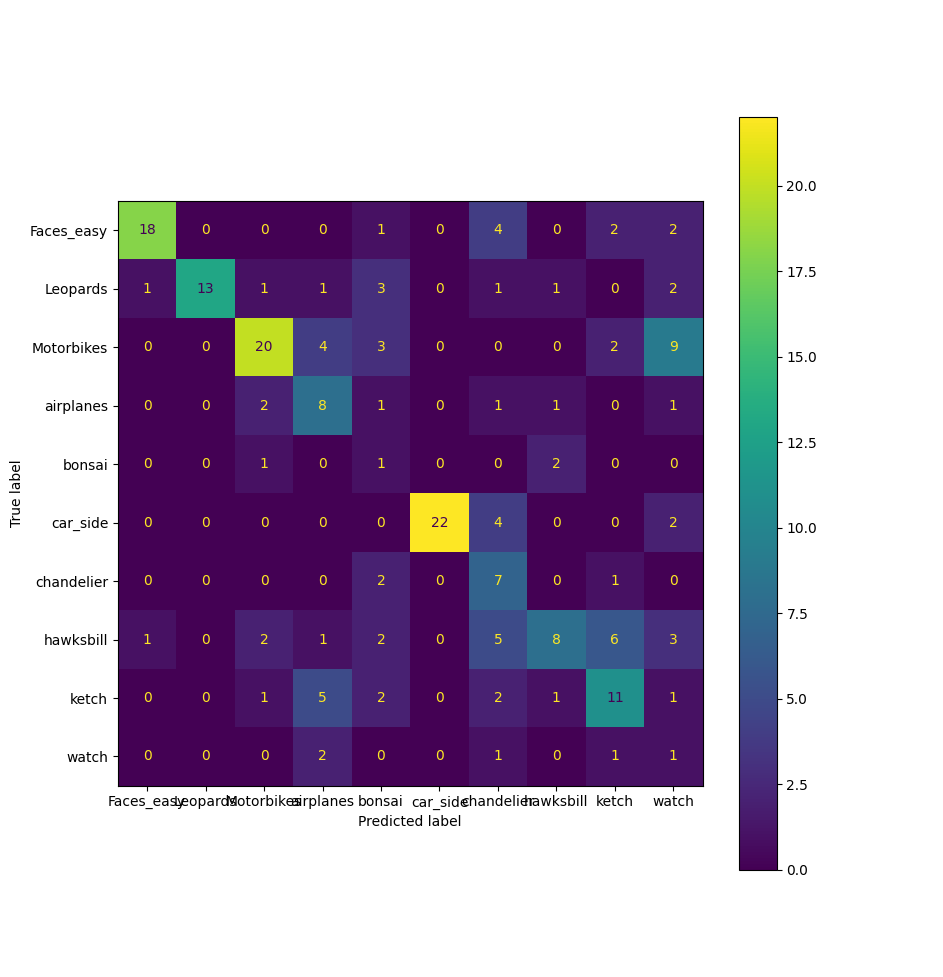
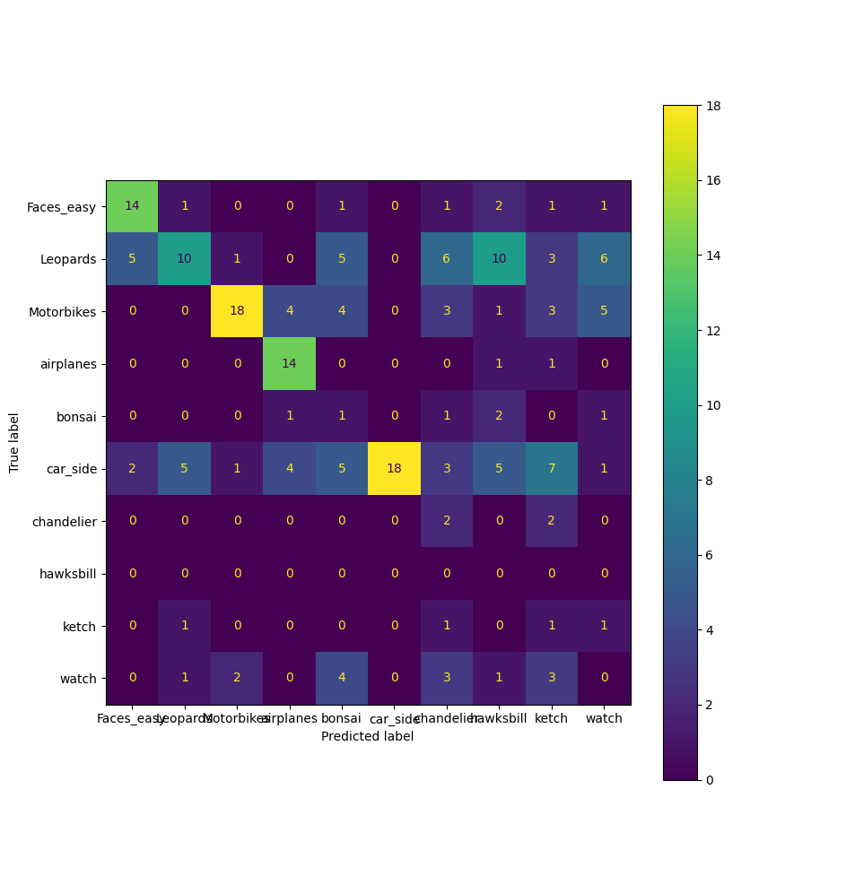

# Classification par histogramme de couleurs

Voici la matrice de confusion obtenue avec le modèle de `LogisticRegression` :

La classes pour laquelles la reconnaissance est la plus précise est `car_side`
La classes pour laquelles la reconnaissance est la plus faible est `watch` ou `bonsai`.
La classes la plus confondues sont `Motorbikes` en `watch`.

On peut supposer qu'il confond la classe `Motorbikes` en `watch`, car les images de `Motorbikes` sont sous fond blanc et certaines de `watch` aussi.

# Classification par histogramme LBhP

Voici la matrice de confusion obtenue avec le modèle de `LogisticRegression` :

Les classes les mieux reconnaissance sont `Motorbikes` et `car_side`.
Les classes significativement moins reconnu sont `bonsai`, `chandelier`, `hawksbill`, `ketch` et `watch`.
On remarque qu'avec l'histogramme de couleurs, on obtient de meilleurs résultats.
On peut supposer que la couleurs est une information importante pour la reconnaissance sur ce dataset.

# Fusion de descripteurs

La taille final du descriptor est le somme des tailles de chaque descripteur.
Voici les differents accuracy obtenus:

- Histogramme de couleurs : 0.545
- LBP: 0.39
- Fusion: 0.55

On peut supposer que grâce à la fusion des descripteurs, on obtient de meilleurs résultats. Car on garde l'information sur les couleurs, en plus de l'information de la forme.

# Découpage géométrique des images
